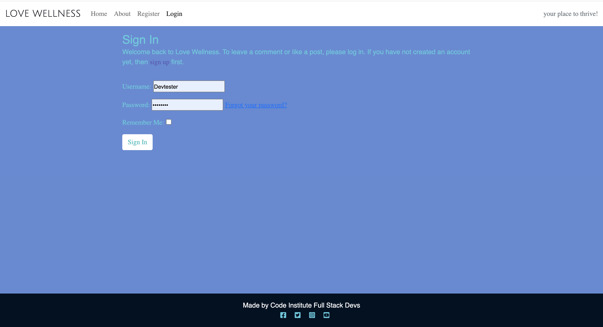

 <h1 align="center">Love Wellness</h1>                                      

This project utilises a full-stack framework, incorporating PostgreSQL, Django, Python, JavaScript, HTML, and CSS. Our objective is to develop a responsive website that enables users to perform CRUD operations, as well as post, comment, and interact with events by liking or unliking them. It's important to note that this project has been created solely for educational purposes.

**[Visit Our Website](https://amandaci-hackathon-full-stack-c93f844af683.herokuapp.com/)**

## Overview

### Services Available:

#### Benefits of Our Services and Website:

- Index – Table of Contents

1. [User Experience (UX)](#user-experience-ux)
2. [Features](#features)
3. [Design](#design)
4. [Technologies Used](#technologies-used)
5. [Testing](#testing)
6. [Deployment](#deployment)
7. [Credits](#credits)

## User Experience (UX)

Applying fundamental UX principles, we initially focused on devising a strategy by identifying the target audience and determining the features that would offer them the most value.

The intended users of "Love Wellness" are students who are part of the campus community.

The target audience for 'Love Wellness':

- A wide range of students on campus, spanning various age groups, with a predominant presence of individuals interested in wellness.
- Attendees seeking inspiration and guidance in maintaining their physical and mental well-being through campus events.
- Students enthusiastic about participating in wellness activities and sharing their experiences with peers.
- Those who are new to wellness practices but are eager to explore and learn from campus event.
- Students from diverse backgrounds, including those from different academic disciplines and cultural backgrounds.
- Individuals who prioritise their health and well-being and actively seek opportunities to enhance their overall wellness.
- Students who are looking for practical strategies and resources to manage stress, improve fitness, and promote mental clarity.
- Those who enjoy engaging in community events and building connections with like-minded peers through wellness activities on campus.
-  Tailored for students aiming to enhance their brain power, for academic purposes.

For a learner wellness website, users will be looking for:

- Accessible Event Information: Clear and detailed descriptions of upcoming wellness events, including dates, times, locations, and any requirements or special instructions.
- Easy Registration Process: Seamless registration or booking process for events, workshops, or classes, allowing users to sign up with minimal effort and providing confirmation of their attendance.
- Diverse Event Offerings: A variety of wellness events catering to different interests and needs, such as super brain yoga sessions, Qigong meditation workshops, nutrition talks, cross fitness classes, and mental health seminars.
- Interactive Features: Opportunities for users to engage with the website, such as leaving reviews or ratings for events they've attended, sharing their experiences, or participating in discussions with other attendees.
- Personalised Recommendations: Suggestions for relevant events based on user preferences, past attendance history, or wellness goals, helping users discover new opportunities to enhance their well-being.
- Resourceful Content: Access to additional resources like articles, videos, or downloadable materials related to wellness topics, providing valuable information and guidance beyond event participation.
- Community Support: Integration of social features or forums where users can connect with like-minded individuals, share tips, ask questions, and offer support to one another on their wellness journey.
- Mobile-Friendly Experience: A responsive and mobile-friendly website design that allows users to browse and book events conveniently from any device, whether they're using a smartphone, tablet, or desktop computer.

Benefits for therapy instructors using the site:

- Expanded reach: By listing their therapy sessions on the platform, instructors can extend their reach to a wider audience of potential clients, increasing their visibility and accessibility.
- Streamlined scheduling: The platform provides tools for instructors to manage their therapy sessions, including scheduling appointments, sending reminders, and tracking client progress.
- Client engagement: Instructors can engage with clients through the platform, facilitating communication, sharing resources, and providing support between sessions.
- Feedback loop: The platform allows instructors to collect feedback from clients, enabling them to assess client satisfaction, address concerns, and improve their services.
- Professional networking: Instructors have the opportunity to network with other therapy professionals, exchange insights, and collaborate on client referrals or joint sessions.
- Marketing platform: The site serves as a marketing platform for instructors to showcase their expertise, specialties, and testimonials, attracting new clients and building credibility.
- Flexibility in service delivery: Instructors can customize their therapy offerings, such as individual sessions, group workshops, or online consultations, to accommodate different client needs and preferences.
- Continuing education: The platform may offer resources, training modules, or peer support groups for instructors to enhance their skills, stay updated on industry trends, and maintain professional development.

### A. User Goals
1. As a site user, I want to explore various wellness events to stay informed about the latest offerings and activities.

2. As a site user, I need to find information about the dates, times, and locations of wellness events to attend them in person.

3. As a site user, I expect to have easy access to contact details to inquire about participating in or purchasing tickets for wellness events.

4. As a site user, I desire intuitive navigation throughout the website to enhance my user experience and find relevant information effortlessly.

5. As a student user, I want to easily access information about upcoming wellness events on campus, including workshops, seminars, and classes, so that I can participate in activities that promote my physical and mental well-being.

6. As a student user, I want to have the option to book consultations with wellness professionals, such as nutritionists or counselors, directly through the website, to easily access support and guidance for my health concerns.

7. As a student user, I would like to be able to leave reviews and feedback on wellness services and events that I have attended, to share my experiences with others and help improve the offerings on campus.

8. As a student user, I want the website to provide resources and information about maintaining a healthy lifestyle, including articles, videos, and tips, to support my overall well-being during my time at college.

9. As a site user, I expect to find comprehensive information about available wellness services, including descriptions, schedules, and pricing, to make informed decisions about my health and well-being options on campus.

10. As a site user, I hope to discover a variety of wellness resources, such as articles, videos, and podcasts, curated to address various aspects of mental and physical health, supporting my holistic well-being journey as a college student.

### B. Owner of Site Goals
1. As the owner of the site, I want to integrate social media features to share wellness events and resources on platforms like Instagram and Facebook, enabling students to engage with our content and reach a wider audience.

2. As the administrator, I aim to create a dedicated section for therapist and instructor profiles, allowing students to learn more about the professionals offering services on campus and fostering a sense of trust and connection.

3. As the site owner, I prioritize implementing measures to safeguard student data and ensure compliance with privacy regulations, demonstrating our commitment to protecting user information and building trust within the community.

4. As a site owner, my aim is to establish a seamless booking system for students, allowing them to effortlessly schedule sessions with therapists, instructors, or wellness services. This will facilitate convenient access to support and resources whenever needed.

5. As the site owner, I aim to establish partnerships with local vendors offering healthy food options, allowing students to explore and access nutritious dining choices conveniently through our platform.

6. As a site owner, I aim to create an interactive forum or community space where students can share their wellness journey, exchange tips, and support one another, fostering a sense of belonging and camaraderie within the campus community.

7. As a site owner, I prioritize the inclusion of diverse and inclusive content on the website, ensuring that resources, events, and services cater to the varied needs and backgrounds of our student population, promoting accessibility and equity.

8. As a site owner, I strive to continuously gather feedback from students through surveys, polls, and reviews, allowing us to adapt and improve our offerings based on user input, enhancing the overall experience and effectiveness of the platform.

9. As a site owner, I aim to streamline the registration process for students, making it easy and intuitive to sign up for our wellness services, events, and resources, thereby increasing user engagement and participation.

10. As a site owner, I seek to establish partnerships with local wellness practitioners, therapists, and vendors to expand the range of services and resources available to students on our platform, enriching the overall wellness experience and promoting collaboration within the campus community.

### MoSCoW Prioritisation

We broke down user stories before prioritising and implementing them.
By following this method, we applied MoSCoW prioritisation and labels to our user stories within the Issues tab.

- **Must Have**: guaranteed to be delivered (*max 60% of stories*)
- **Should Have**: adds significant value, but not vital (*the rest ~20% of stories*)
- **Could Have**: has small impact if left out (*20% of stories*)
- **Won't Have**: not a priority for this iteration

## Features

### Existing Features

1. **Navigation Bar**
   - The navigation bar appears on every page so users can easily navigate through the site
   - Navigation bar has links for 'Home', 'About' and 'Login/Register' more links will be shown to logged in users
   - If the user is logged in then the left side of the menu shows links for pages that only authorized users can visit 
   - The user name will also appear on the bar, indicating which user is logged in
   - The navbar is fully responsive, collapsing into a hamburger menu for medium and small screen size

   

2. **Landing Page Image - wellness**
   The landing area includes event images and text, view details button below that clearly identify the purpose of the business and the type of product and service it offers:

   

3. **Footer**
   The footer is featured on all four pages and contains two sections: social media links and website creators:

  

  
  
 

4. **View Details & Attend Page - ‘via Home’**
   
   

  
  

5. **CRUD-Review - ‘via Home’**
   CRUD operations, including like or unlike events:
   

  
  

  

  
  

6. **About Page - ‘About’**
   About instructors. Information on how to get in touch and contact form for convenient communication:

   

  
  
 

   Contact form:

  

  
  
 

7. **Register Page - ‘Register’**
   The register page allows users to create a new account by providing necessary information such as username, email, password, and optional profile details:

   

  
  

8. **Login - ‘Login’**
   Include username and password fields, a remember me option, error handling for incorrect credentials, a login button, links for forgot password and registration, security measures like CAPTCHA or two-factor authentication:

   

  
  

9. **Mobile - 'Responsive'**

   

   
   

 10. **Mobile - 'Navigation Bar'**

   

   
   

 11. **Back End - 'Admin Panel'**

   

   
   

   

   
   

   

   
   

   

   
   

   

   
   

   

   
   

## Design

### Imagery
- The design layout features a clean and minimalistic structure with a simple background, providing a visually uncluttered canvas. Imagery is elegantly incorporated with prominent wellness photos, enhancing the aesthetic appeal.

### Typography
- Google Fonts were used to import the Julius font into styles.css. Chosen for it's simple, unembellished, minimalistic feel that is easy to read.

### Wireframes
Home Page Wireframes:

 

  
  

About & Contact Page Wireframes:

 

  
  

Devices Wireframes: ***TO ADD***

  
  

# Database schema
Prior to initiating any model migrations to my database, I devised an entity relationship diagram to visualise the connections between the models.

The entity relationship diagrams were created using 

  
  

## Models
### **Event Model**

### **Reviews Model**

### **About Model**

### **SubmitDetails Model**

## Technologies Used

### Languages Used
- 
- 
- 
- 

 ## Frameworks, Libraries & Programs Used

- - GitHub is a web-based platform for version control using Git, enabling collaborative software development and hosting of code repositories. GitHub connects to GitPod and Heroku. The team used it for secure online code storage.

-  – Connected to GitHub, GitPod hosted the coding space, allowing the project to be built and then committed to the GitHub repository. The team used it for version control. (`git add`, `git commit`, `git push`)

-  - Connected to the GitHub repository, Heroku is a cloud application platform used to deploy this project so the backend language can be utilised/tested. The team used it forhosting the deployed back-end site.

-  - Django is a high-level web framework for building web applications rapidly with a clean and pragmatic design. The team used it as the Python framework for the site.

-  - ElephantSQL is a hosted PostgreSQL database service that can be seamlessly integrated with Django applications, providing scalable and reliable database solutions. The team used it as the Postgres database.

-  - Gunicorn is a pure-Python HTTP server for WSGI applications. Followed Code Institute instructions to install.

-  - This allows you to utilise the 12factor inspired DATABASE_URL environment variable to configure your Django application. Followed Code Institute instructions to install.

-  - Bootstrap is a front-end framework for developing responsive and mobile-first websites quickly and efficiently. The team used it to utilised for modern responsiveness and pre-built components.

- - Cloudinary is a cloud-based media management platform that offers solutions for storing, optimising, and delivering images and videos for web and mobile applications. Followed Code Institute instructions to install.

-  - Summernote is a Django app that enables users to easily integrate a rich text editor into their web applications, enhancing event creation and description functionality. Followed Code Institute instructions to install.

-  - DALL-E3 is an advanced AI model developed by OpenAI that generates images from textual descriptions. The team used it for the images created using text.

-  - TinyPNG is a website that offers image compression services to optimise image files for faster loading on webpages while maintaining visual quality. The team used it to compress the images.

-  - Google Fonts is a collection of free, open-source fonts that can be easily integrated into websites and other digital projects to enhance typography. Imported for fonts.

-  - Font Awesome is a library of scalable vector icons that can be easily customised and used to enhance the visual appeal of websites and applications. Imported to base.html.

-  - Beautify is a code formatter tool that automatically formats code to improve readability and consistency. Used in Gitpod to help color code and spot errors.

-  - Balsamiq is a wireframing tool used for creating low-fidelity mockups of user interfaces, allowing for quick and easy visualisation of design ideas. used for our wireframes.

-  - Lucidchart is a web-based diagramming tool that allows users to create and collaborate on flowcharts, ERDs, and other visual representations of data and processes. Made an ERD flow chart to provide a visual starting point for database design and help determine information system requirements throughout our collaboration.

-  - Am I Responsive is a web tool that allows users to quickly preview how their website appears on various devices and screen sises, helping to ensure responsiveness and compatibility across platforms. Put my heroku url to check responsivity to all devices.

-  - Diffchecker is a text comparison tool used to highlight the differences between two blocks of text, facilitating comparison and analysis. Update code against old code for validation.

-  - The W3C CSS Validator is a tool used to check the validity and syntax of CSS code, ensuring compliance with web standards set by the World Wide Web Consortium (W3C). Import our CSS for validation.

-  - The W3C Markup Validator is a tool used to check the validity and syntax of HTML code, ensuring compliance with web standards set by the World Wide Web Consortium (W3C). Import our HTML for validation.

-  - JSHint is a static code analysis tool used for checking JavaScript code for errors, potential problems, and stylistic inconsistencies. Import our JS code for validation.

- - Pep8ci provides Python developers with a tool to check their code against the PEP 8 style guide for adherence to coding standards. Import our Python code for validation.

- - an open-source tool used for auditing web page quality, including performance, accessibility, SEO, and cross-browser testing. Check for validation.

-  - The events page on our site drew inspiration from the "I think therefore I blog" walkthrough project by Code Institute. Throughout the past 16 weeks, our participation in the Full Stack skills boot camp has equipped me with the essential skills needed to develop this website.

*Below, you'll find a comprehensive list of project requirements and their respective versions. Some installed packages were not utilised but were installed as per the instructions provided by Code Institute. This influenced our decision to document the process in the 'I think therefore I blog' walkthrough project.*

- asgiref==3.7.2  
- cloudinary==1.36.0  
- crispy-bootstrap5==0.7  
- dj-database-url==0.5.0  
- dj3-cloudinary-storage==0.0.6  
- Django==4.2.11  
- django-allauth==0.57.2  
- django-bootstrap-v5==1.0.11  
- django-crispy-forms==2.1  
- django-summernote==0.8.20.0  
- gunicorn==20.1.0  
- oauthlib==3.2.2  
- psycopg2==2.9.9  
- PyJWT==2.8.0  
- python3-openid==3.2.0  
- requests-oauthlib==1.4.0  
- sqlparse==0.4.4  
- whitenoise==5.3.0  

## Testing ***TO ADD BELOW***

### Validator Testing
* [Lighthouse](#lighthouse)
* [HTML](#html)
* [CSS](#css)
* [JSHINT](#jshint)
* [CI Python Linter](#cipythonlinter)

# Lighthouse 

Desktop

Mobile

# HTML Validator
- [Results for index.html](#)
- [Results for gallery.html](#)
- [Results for contact.html](#)

# CSS Validator
- [Results for styles.css](#)

#### Browser Compatibility
- Chrome Version 90.0.4430.212
- Firefox Version 88.0.1
- Safari on macOS Catalina (Safari Version 14.0.3)

### Unfixed Bugs
- Correction to add: 
 

### Known Bugs
1. 
2. The submit button on the form was not responding.

## Deployment

### How this site was deployed
1. In the GitHub repository, navigate to the Settings tab, then choose Pages from the left-hand menu.
2. From the source section drop-down menu, select the Master Branch.
3. Once the master branch has been selected, the page will be automatically refreshed with a detailed ribbon display to indicate the successful deployment.
4. Any changes pushed to the master branch will take effect on the live project.
5. The live link can be found [https://github.com/AmandaCIdev/love_wellness](#).

### How to clone the repository
1. Go to the GitHub repository on GitHub.
2. Click the "Code" button to the right of the screen, click HTTPs and copy the link there.
3. Open a GitBash terminal and navigate to the directory where you want to locate the clone.
4. On the command line, type "git clone" then paste in the copied URL and press the Enter key to begin the clone process.

## Credits

### Content
- All content was written by the developers.

### Media
- The icons in the footer were taken from Font Awesome.
- The fonts used were imported from Google Fonts.
- Favicon: AI-DALL-E 3.

### Acknowledgments
- To be added.

## Full Stack Developer Team

+ Team Lead: Amanda Mascurine
  - https://github.com/AmandaCIdev

+ Carl Sparks
  - https://github.com/Sparkeeee

+ Gray Adamson
  - https://github.com/GrayAdamsonWelsh

+ Ifzal Malook
  - https://github.com/ifzalmalook

